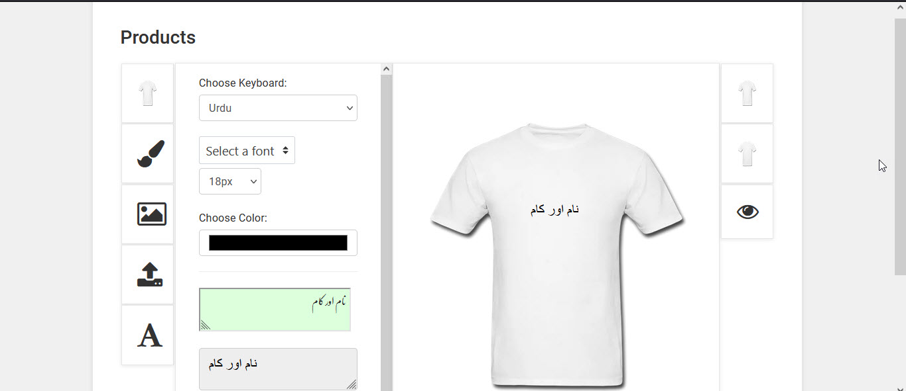

# Product-Designer (Urdu)
Product Designer powered by PHP and jQuery.

### Features:
Add design to front and back (depends on the product)
Upload your own design. 
Choose stock designs.  
(You can add more stock designs, to add stock desigs simple copy and paste design to the assets/img/design_templates ) 
Add Any Text that you want. 
Print Preview Product. 
Change Product Color (it Depends to the product, you can add it by yourself.) 
Add Text in Urdu Language  

Basically to run this you need Apache and PHP installed.
or just simply use XAMP or equivalent.
### Screenshot:

### Contact:
urdujini@gmail.com  
(https://www.ajsoftpk.com/naseem_amjad/urdu/)
